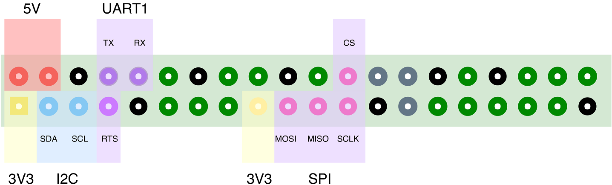

# 欢迎使用咸鱼派 SFPi

## 概述
咸鱼派是一款基于 Allwinner V3s 处理器的单板计算机（SBC），形状与树莓派一致，
提供了丰富的接口和外设，非常适合中低性能产品开发。

## 特性
- Cortex-A7 1.2GHz（ARM v7-A）处理器
- 64 MiB DRAM
- 100 Mbps 以太网
- **PoE**、12V DC、Micro USB 三种供电方式
- **内置硬件看门狗模块**
- SD/MMC 卡，预留 SPI Flash 焊盘（SOIC-8 封装）
- 内置 USB TTL (CH330) 模块
- 双路 USB 2.0 接口
- 3.5mm 音频输出、麦克风输入
- 支持 Wi-Fi（802.11 bgn）和 Bluetooth 4.0
- IO（GPIO/SPI/I2C/UART）与树莓派几乎兼容，适配常见树莓派扩展板
- 适配常见树莓派外壳
- Linux 主线支持

## 快速开始

## 资料下载
- [原理图](https://github.com/sbc-fish/sfpi/raw/master/hardware/Schematic.pdf)
- V3s 数据手册

